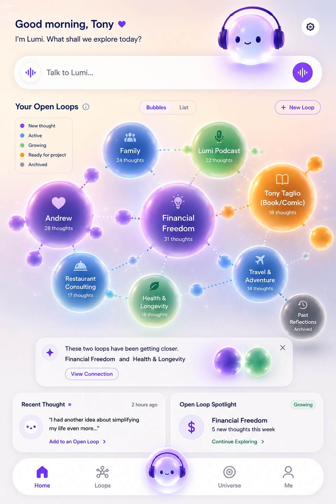
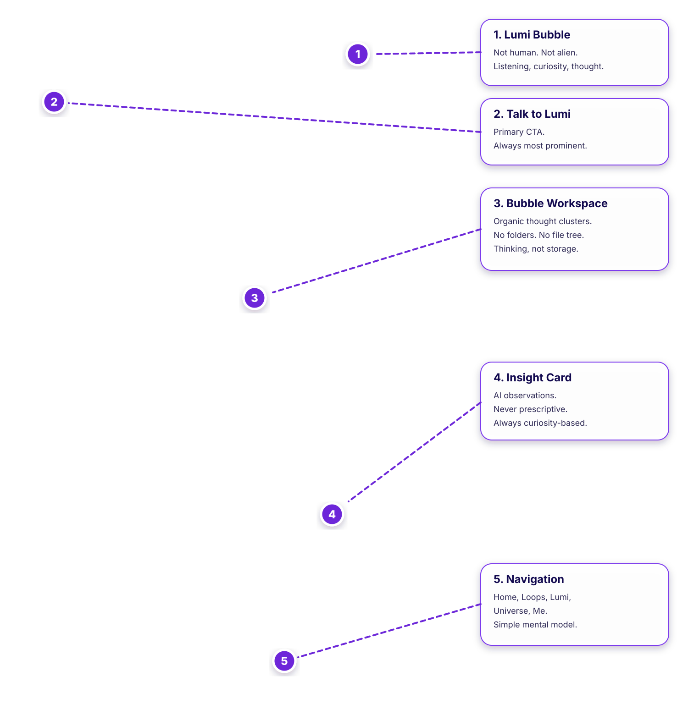

# Home Screen v1 Notes

Status: Draft v1.0
Last Updated: 2026-07-03
Owner: Founder / Design

## Purpose

Document the approved Home Screen v1 UX reference, also preserved as Open Loops UX Vision 0.1, and the design decisions encoded in [UX_Vision_0.1.png](UX_Vision_0.1.png).

## Reference Image

Alias:

## Annotated Reference

Alias:

## UX Vision Version

This reference is preserved as **Open Loops UX Vision 0.1**.

Every meaningful design leap should create a new visual version:

- UX Vision 0.2
- UX Vision 0.3
- UX Vision 1.0

The goal is to preserve the visual history of how Open Loops evolves from an AI-app interpretation into its own product category.

## Canonical Role

`HomeScreen_v1.png` is the official Version 1 UX reference for the Open Loops MVP.

`UX_Vision_0.1.png` is the versioned archival name for the same visual direction.

It communicates interaction model, visual hierarchy, product philosophy, and emotional tone. It is not intended to lock exact pixels, colors, typography, or spacing.

Do not faithfully reproduce the mockup pixel-for-pixel. Preserve the philosophy behind the layout. The implementation should feel organic, calm, spacious, and alive while remaining technically practical.

## Decisions Encoded In The Mockup

- Lumi greets the user personally.
- Talk to Lumi is the clearest primary action.
- The product opens with relationship, not a dashboard.
- Open Loops are visualized as bubbles, not folders.
- Each bubble represents an evolving thought subject.
- Bubble labels use meaningful human subjects.
- Thought counts communicate depth or activity.
- Loop status can be communicated through color and legend.
- Related loops can be connected visually.
- Lumi can surface a connection insight.
- Users can view a connection without being forced to merge it.
- Recent thoughts can be added into an Open Loop.
- The Open Loop Spotlight encourages continuing an existing thought thread.
- Navigation preserves Home, Loops, Lumi, Universe, and Me.
- The experience should feel calm, luminous, spacious, and alive.

## Numbered Callouts

### 1. Lumi Bubble

- Not human.
- Not alien.
- Represents listening and curiosity.
- Should feel intelligent and comforting without pretending to be a person.

### 2. Talk to Lumi

- Primary CTA.
- Always the most prominent action.
- The fastest entry point into the relationship.
- Should remain visually dominant over secondary navigation.

### 3. Open Loops Bubble Workspace

- Organic thought clusters.
- No folders.
- No file tree.
- Communicates that Open Loops organizes thinking, not information.

### 4. Insight Card

- AI-generated observations.
- Never prescriptive.
- Always curiosity-based.
- Should help the user notice a possible connection without forcing action.

### 5. Navigation

- Home
- Loops
- Lumi
- Universe
- Me

The navigation model should remain simple and stable unless intentionally revised.

## Implementation Notes

Preserve the underlying model even when adapting layout:

- Header greeting
- Lumi presence
- Primary voice/conversation input
- Open Loops workspace
- Bubbles/List toggle
- New Loop action
- Connection insight card
- Recent Thought card
- Open Loop Spotlight card
- Bottom navigation

Implementation should optimize for product usability, responsiveness, and technical practicality while preserving the mockup's philosophy.

## Non-Goals

- Pixel-perfect reproduction
- Treating the mockup as finished visual design
- Final brand system
- Final responsive layout
- Final animation system
- Final data visualization rules

## Decision References

- See [DECISIONS.md](../DECISIONS.md) for approved UX reference decisions.

## Related Documents

- [UX](../UX.md)
- [UX Vision History](UX_VISION_HISTORY.md)
- [Open Loops Product](../OPEN_LOOPS_PRODUCT.md)
- [Version 1 Roadmap](../VERSION1_ROADMAP.md)
- [Technical Architecture](../TECHNICAL_ARCHITECTURE.md)

## Open Questions

- Which elements should be interactive in the first prototype?
- How should connection insights be generated and ranked?
- Should bubble size represent thought count, recency, emotional weight, or a combined score?
- What is the minimum viable animation system for drifting bubbles?

## Version 1 Boundaries

- Do not treat this image as final production artwork.
- Do not build advanced graph physics before the basic bubble workspace is usable.
- Do not expand beyond the Home Screen model before the core Open Loop interaction is validated.
